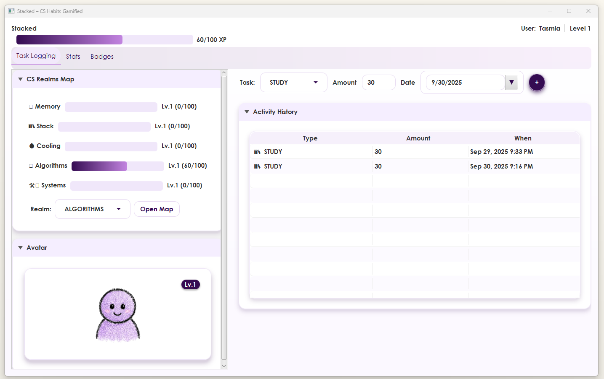
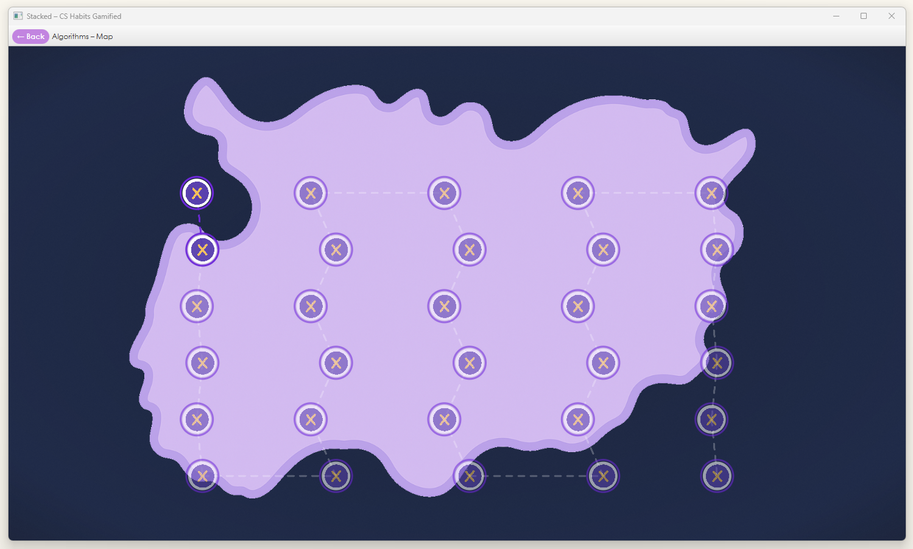
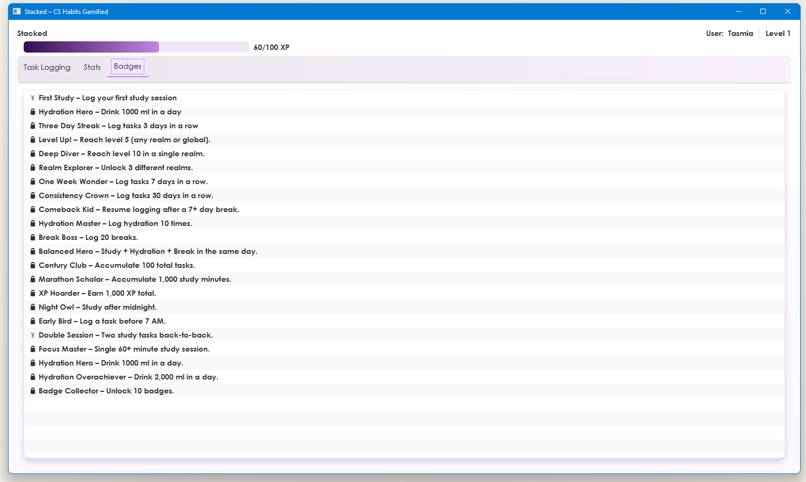

# Stacked – CS Habits Gamified

Team Name: Gits & Giggles  
Supervisor: Ishmam Tashdeed, Lecturer, Dept. of CSE, IUT  

Stacked is a desktop app that helps Computer Science students build consistent study habits with gentle gamification.  
Users log three simple actions — Study, Hydration, Break — and instantly see progress as XP, levels, badges, and an evolving avatar.  

Each CS realm (Algorithms, Memory, Stack, Cooling, Systems) has a themed map with clickable nodes that open curated learning links (e.g., LeetCode problems).  
All progress is saved offline to a local JSON file, so no account is required.  

---

## ✨ Features

- Task Logging & XP
  - Log Study / Hydration / Break with amount & date.
  - XP, levels, and progress bars update smoothly.

- Streaks & Badges
  - Daily streaks with multipliers.
  - Unlock milestone badges like *First Study*, *Hydration 1000ml*, *Focus Master*.
  - Avatars evolve and react to your progress.

- Realm Maps
  - Themed maps with clickable nodes.
  - Each node opens curated learning resources.
  - Coordinates handled with safe letterboxing math.

- Offline Friendly
  - JSON persistence (profile, entries, badges).
  - No accounts or servers required.

---

## 🛠 Tech Stack

- Language: Java 17/22  
- UI: JavaFX (FXML + CSS)  
- Build Tool: Maven  
- Data: Local JSON files  
 

Why JavaFX? → Native desktop performance, CSS theming, and layout control without a heavy runtime.  

---

## 🏗 Architecture Overview

- UI (JavaFX FXML + CSS) – Main screen (task logging, history, avatar) and Realm Map screen.  
- MainController – Connects UI to services, triggers updates, animations.  
- Services  
  - XpService: Level/XP math, clamped progress.  
  - StreakService: Daily streaks and multipliers.  
  - BadgeService: Unlocks based on small, idempotent rules.  
  - RealmLayoutService: Map image, normalized coordinates, node URLs.  
  - AvatarService: Avatar selection based on XP and badges.  
- Persistence – `LocalStore` reads/writes JSON safely and idempotently.  

Flow:  
User logs a task → XP & streak update → Badges checked → Avatar/Progress updated → JSON persisted.  

---

## 🚀 Getting Started

### Prerequisites
- Java 17 or later
- Maven

### Installation & Run

Clone the repo:
```bash
git clone https://github.com/nashatislam/Stacked.git
cd Stacked
```

Build the project:
```bash
mvn clean install
```

Run the app:
```bash
mvn javafx:run
```

---

## 📸 Screenshots








---

## 👥 Team

- Nashat Islam [https://github.com/nashatislam] – Task Logging, Badge System, Map Link Unlocking  
- Tasmia Tabassum [https://github.com/tasmiatabassum] – Core XP logic, Navigation, Realm Maps, Overall UI  
- Subha Tamanna Mrittika [https://github.com/Tamanna-Mrittika] – Persistence (LocalStore), Avatar Evolution  

---

## ⚡ Challenges We Solved (September 5th,2025)

- Sliding progress bar – Fixed with clamped denominators and safe animations.  
- Theme reverting after navigation – Solved by reapplying `app.css` via a theme guard.  
- Map node drift – Fixed by converting normalized coordinates into displayed bounds.  
- Date handling for streaks – Used `LocalDate` consistently to avoid edge cases.  

---

## 🎯 Motivation

Students often lose momentum with traditional trackers that feel like spreadsheets.  
We designed Stacked to be:  
- Immediate – instant visual feedback  
- Simple – only three core actions  
- Rewarding – XP, levels, avatars, and badges  
- Offline-friendly – no accounts, no servers  

---

## 📚 Lessons Learned

- Small UI details (spacing, focus rings, animations) matter for user experience.  
- Keeping services pure/idempotent makes the app more reliable.  
- Explicit handling of real layout rectangles prevents UI bugs.  
- A clear core loop is more effective than overloaded features.  

---

## 📄 License

This project is for educational purposes.  
You may adapt and modify it for personal or academic use.  

---

## 🔗 Repository

GitHub (public): [Stacked Repo](https://github.com/nashatislam/Stacked)  
